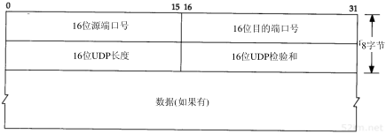
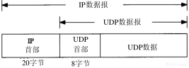
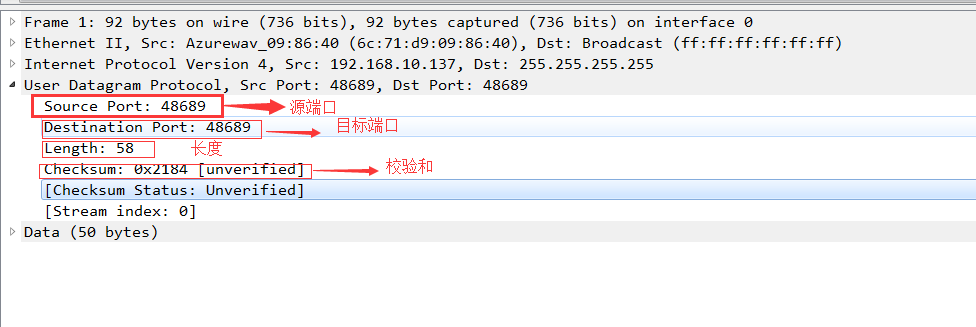

# UDP（用户数据报协议）

> 用户数据报协议（User Datagram Protocol，UDP）UDP是OSI参考模型中一种无连接的传输层协议，它主要用于不要求分组顺序到达的传输中，分组传输顺序的检查与排序由应用层完成 ，提供面向事务的简单不可靠信息传送服务。

## 一、UDP协议

1、面向事物，不是面向链接

2、UDP不提供可靠性：它把应用程序传给IP层的数据发送出去，但是并不保证它们能到达目的地

简单的可以理解UDP就是类似一个邮寄员的角色。你只要告诉它，对方的地址和电话。邮递员就把你的快递送到对应的地方，但是中间可能会丢失。对方收到没有，就不管了。

## UDP头部信息

> 指定通信的源端端口号、目的端端口号、UDP长度、校验和、数据

  
  

UDP报文各个位置详解：

- 1、源端口号，16bit
- 2、目的端口号：数据接收者的端口号，16bit
- 3、UDP长度：UDP长度字段指的是UDP首部和UDP数据的字节长度。该字段的最小值为8字节
- 4、UPD校验和：UDP检验和覆盖UDP首部和UDP数据
- 5、首部长度：首部中32bit字的数目，可表示15*32bit=60字节的首部。一般首部长度为20字节。
- 6、数据

使用**wireshark**抓包查看对应的字段信息。

